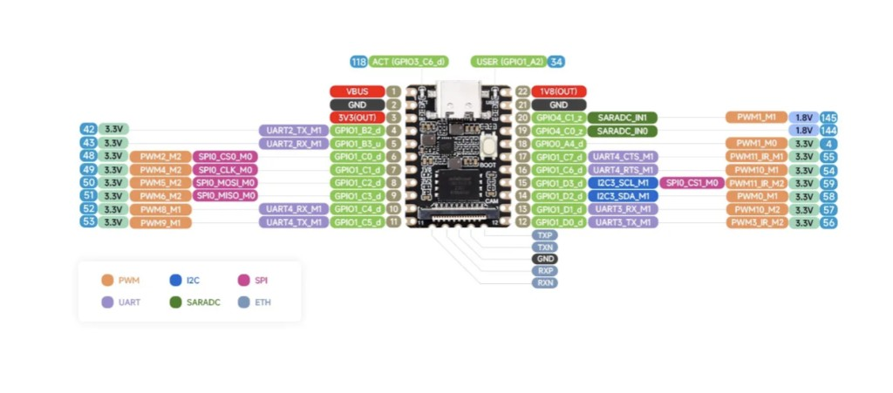

# 7. OLED-экран: подключение и настройка

Этот шаг опциональный. Без экрана всё продолжит работать — количество объектов и координаты вы всё равно увидите в консоли платы и в инструменте с шага [08](08-pc-monitor-tool.md). Экран просто даёт возможность посмотреть результат "не отходя от платы", без компьютера.

Подходит любой маленький I2C-экран на контроллере **SSD1306** или совместимом (SSD1315 и т.п.), обычно 128×64 точек — это самый massовый и дешёвый тип OLED-модулей, продаётся под разными названиями. Важно, чтобы модуль был именно **I2C** (4 контакта: VCC, GND, SDA, SCL), а не SPI (там контактов больше).

## 7.1. Распиновка / куда паять



| Контакт экрана | Контакт платы | Назначение |
|---|---|---|
| **VCC** | пин **3** (`3V3(OUT)`) | питание 3.3 В |
| **GND** | пин **2** или **21** (`GND`) | земля |
| **SDA** (иногда `DIN`) | пин **14** (`I2C3_SDA_M1`) | данные I2C |
| **SCL** (иногда `CLK`) | пин **15** (`I2C3_SCL_M1`) | тактирование I2C |

```text
Экран OLED           Luckfox Pico Mini
   VCC   ───────────  пин 3   (3V3)
   GND   ───────────  пин 2   (GND)
   SDA   ───────────  пин 14  (I2C3_SDA_M1)
   SCL   ───────────  пин 15  (I2C3_SCL_M1)
```

Логика на плате 3.3 В — большинство OLED-модулей на SSD1306 рассчитаны именно на 3.3-5 В и спокойно работают от 3.3 В, но если сомневаетесь — проверьте маркировку конкретно вашего модуля.

Припаяйте 4 провода по таблице выше (или используйте штыревые разъёмы/переходники, если не хочется паять напрямую в плату).

## 7.2. Включаем шину I2C3 на плате

По умолчанию I2C3 выключен в конфигурации платы. Включить можно через утилиту `luckfox-config`:

```bash
adb shell
luckfox-config
```

В открывшемся текстовом меню: `Advanced Options → I2C → I2C3_M1 → Enable`, укажите скорость **100000** (100 кГц), выйдите из конфигуратора (`Save & Exit`).

Если меню неудобно или скрипт зависает в вашем терминале — то же самое можно сделать напрямую, отредактировав файл конфигурации:

```bash
grep -q I2C3_M1_STATUS /etc/luckfox.cfg || echo "I2C3_M1_STATUS=1" >> /etc/luckfox.cfg
grep -q I2C3_M1_SPEED /etc/luckfox.cfg || echo "I2C3_M1_SPEED=100000" >> /etc/luckfox.cfg
luckfox-config load
```

После этого должно появиться устройство `/dev/i2c-3`:

```bash
ls -l /dev/i2c-3
```

> Настройка `/etc/luckfox.cfg` сохраняется на SD-карте и остаётся после перезагрузки. Но если вы перепрошивали плату заново — эти шаги нужно повторить.

## 7.3. Проверяем, что плата видит экран

```bash
i2cdetect -y 3
```

Экран на SSD1306 почти всегда сидит на адресе **0x3C** (реже 0x3D). В выводе команды вы должны увидеть число `3c` в соответствующей ячейке таблицы:

```text
     0  1  2  3  4  5  6  7  8  9  a  b  c  d  e  f
00:          -- -- -- -- -- -- -- -- -- -- -- -- --
...
30: -- -- -- -- -- -- -- -- -- -- -- -- 3c -- -- --
```

Если строка `i2cdetect` вообще не выполняется («command not found») — значит на образе нет пакета `i2c-tools`, тогда просто пропустите этот шаг проверки и переходите к запуску программы — она сама сообщит, нашла ли экран.

Если адрес не появился:
- перепроверьте пайку/провода (особенно GND и питание);
- убедитесь, что I2C3 точно включился (`ls /dev/i2c-3` должен существовать);
- попробуйте адрес `0x3D` вместо `0x3C`, если у вашего конкретного модуля он другой (смотрите маркировку/документацию продавца).

## 7.4. Код

Поддержка экрана уже встроена в [`cpp/HelloDetector/src/main.cc`](../cpp/HelloDetector/src/main.cc) — отдельно ничего писать не нужно, программа сама:

- пробует открыть `/dev/i2c-3` и адрес `0x3C` при старте;
- если экран не найден — просто продолжает работать без него (это не ошибка);
- если найден — выводит `detected: N` и координаты каждого найденного объекта.

Если у вашего модуля адрес `0x3D`, поменяйте `#define OLED_ADDR 0x3C` на `0x3D` в `main.cc` перед сборкой (шаг [06](06-build-and-deploy.md)).

### Почему на экране не видно имя класса объекта

У маленького OLED очень мало места (128×64 точки, шрифт 5×7), и в коде используется урезанный набор символов (только то, что нужно для служебных фраз "detected" / "no detection" + цифры). Имя класса при этом всё равно видно:

- в консоли платы (`printf`, там полный текст без ограничений);
- на кадре `out.jpg`, который программа сохраняет на каждом кадре (там текст рисуется через OpenCV, шрифт полноценный);
- в мониторе для ПК из [08-pc-monitor-tool.md](08-pc-monitor-tool.md).

Если хочется, чтобы имя класса выводилось прямо на OLED — дополните таблицу `FONT5x7` и функцию `font_index()` в `main.cc` нужными буквами (по образцу уже добавленных) и добавьте вызов вывода имени в `oled_show_dets()`.
